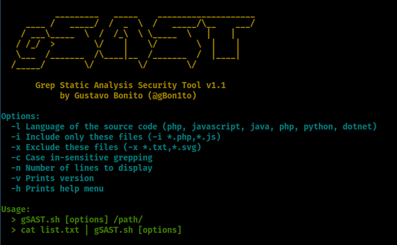

# gSAST - Grep Static Analysis Security Tool

Grep Static Analysis Security Tool or gSAST is a tool that I've developed for the OSWE certification, using shell scripting (bash), in order to simplify the process of manual source code analysis.

A complete demonstration of gSAST can be found [on my website](https://gustavobonito.pt/posts/gsast/).

*Note: It is important to note that gSAST **is not** any sort of vulnerability scanner.*